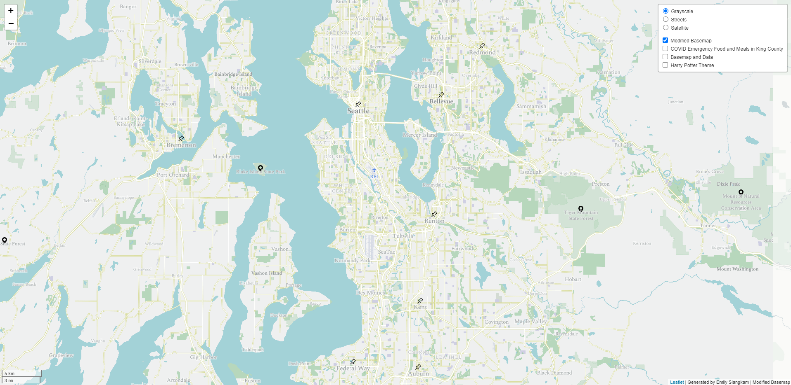

# Visualizations of King County, WA and COVID Emergency Meals
A Leaflet map of COVID emergency food and meals throughout Seattle and King County, WA. https://esiangkam.github.io/emergencyfoodcovid/index.html

## Introduction
This is a webmap that displays a modified basemap, emergency food and meals in King County during COVID, and a Harry Potter themed basemap. Since the data for the thematic layer specifically centers upon King County, the examined geographic area reflects King County - with data focused most popularly in Seattle. The map can be accessed [here](https://esiangkam.github.io/emergencyfoodcovid/index.html).

## Contents
- assets - tile images
- img - map screenshots
- tiles_html - HTML files for tiles
- index.html - consolidates tiles to create webmap

## Layer 1: Modified Basemap

This is a modified basemap created using MapBox. Starting from a more neutral gray, the basemap highlights greenspaces throughout King County in green, school spaces in purple, points of interest in orange, and water in blue. Since the second and third layers include data specific to places that a person may use to find emergency food, highlighting these areas facilitate and better connect with the intended message. Some changed icons include an angled pushpin for cities, and placemarkers for points of interest. The font has been changed to Spectral.

Geographic Area of Focus: Seattle, WA and surrounding locations in King County

Zoom Level: The minimum zoom level is 10, and the maximum is 14. This ensures that the user can easily identify the area of focus, without losing or being overwhelmed with too much detail while zoomed too far in or out.

## Layer 2: COVID Emergency Food and Meals in King County

This is a thematic layer featuring different meals throughout King County. Here, the user can see 4 different types of resources available for them: meals (depicted with a plate), student to-go meals (shown with a sack lunchbag), food banks (indicated by a shopping basket of groceries), and food banks and meals (depicted by a person at a table with food).

Geographic Area of Focus: Seattle, WA and surrounding locations in King County

Zoom Level: The minimum zoom level is 10, and the maximum is 14. This ensures that the user can easily identify the area of focus, without losing or being overwhelmed with too much detail.

## Layer 3:

This layer includes both the basemap and the thematic layer. The user can locate places for emergency food, and more easily find these places using the basemap that highlights points of interests and schools, along with the streets that can be used to get to such places.

Geographic Area of Focus: Seattle, WA and surrounding locations in King County

Zoom Level: The minimum zoom level is 10, and the maximum is 16. This ensures that the user can easily identify the area of focus, without losing too much detail. In comparison to the previous map, the user is able to use the basemap to identify the roads they can use to get to the locations they need, as well as see the kinds of areas that these resources are most commonly available in.

## Layer 4: Harry Potter Theme

This is a more fun basemap theme that does not necessarily have relation to COVID emergency food - it merely takes colors specific to the Gryffindor House (maroon and golden rod), and the blue of Ravenclaw for water, based on the fictional realm of Harry Potter by JK Rowling. As such, wands have been added to points of interest,

Geographic Area of Focus: Seattle, WA and surrounding locations in King County

Zoom Level: The minimum zoom level is 10, and the maximum is 14. This ensures that the user can easily identify the area of focus, without losing or being overwhelmed with too much detail.

## Attributions
The maps for this project were created through [Mapbox](https://www.mapbox.com/), and the data for the thematic layer was collected from the City of Seattle Human Services Department's [dataset on COVID Emergency Food and Meals Seattle and King County](https://data.seattle.gov/Community/COVID-Emergency-Food-and-Meals-Seattle-and-King-Co/kkzf-ntnu). Some pieces of code used for this project have been provided by Professor Bo Zhao as part of [GEOG 458's Lab 4](https://github.com/jakobzhao/geog458/tree/master/labs/lab04).

SVG icons for thematic layers are provided by FlatIcon. In particular, thank you to  [photo3idea_studio](https://www.flaticon.com/authors/photo3idea-studio) for the plate icon, [Freepik](https://www.flaticon.com/authors/freepik) for the broom, wand, food bank, and groceries icon, [Vectors Market](https://www.flaticon.com/authors/vectors-market) for the lightning icon, and Flat Icons for the lunchbag icon. Additionally, the [Harry Potter font](https://www.dafont.com/harry-p.font) was made available by [Phoenix Phonts](https://www.dafont.com/phoenix-phonts.d214) on Da Font.
